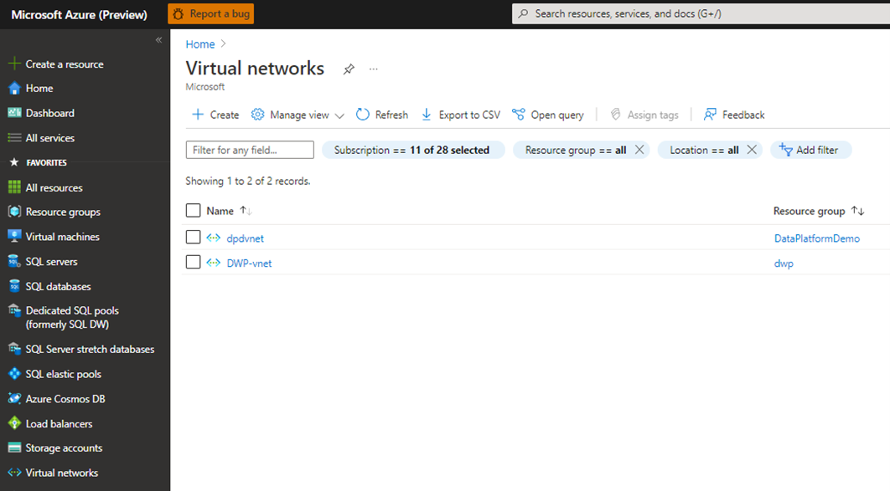
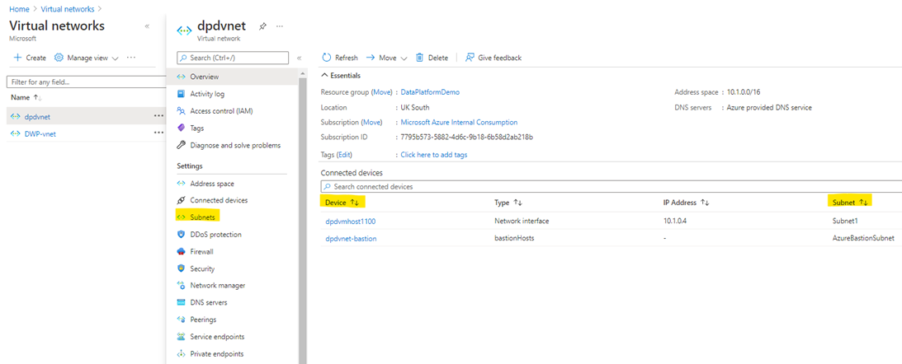
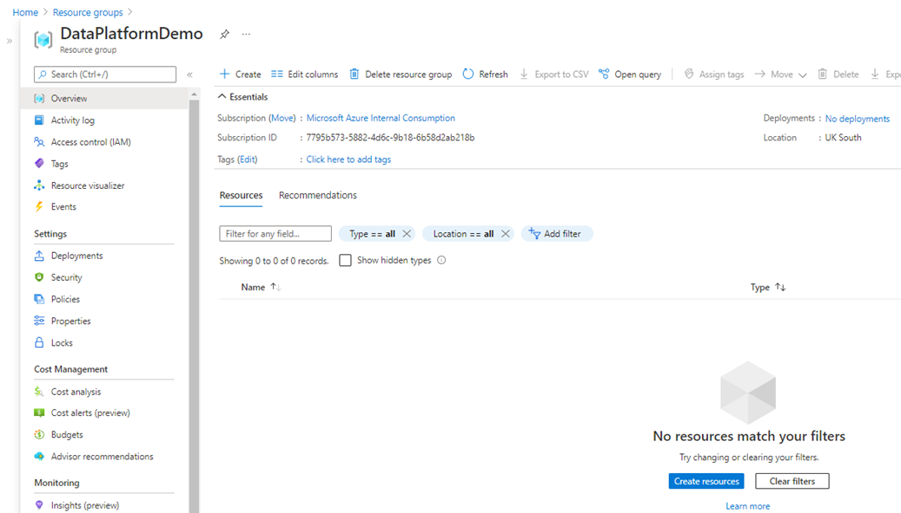
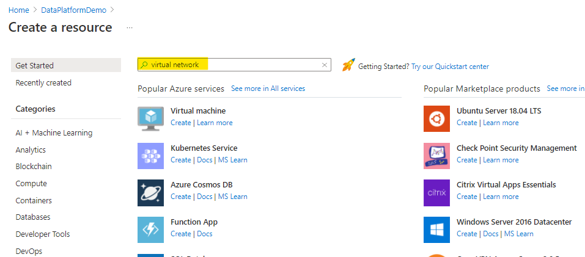
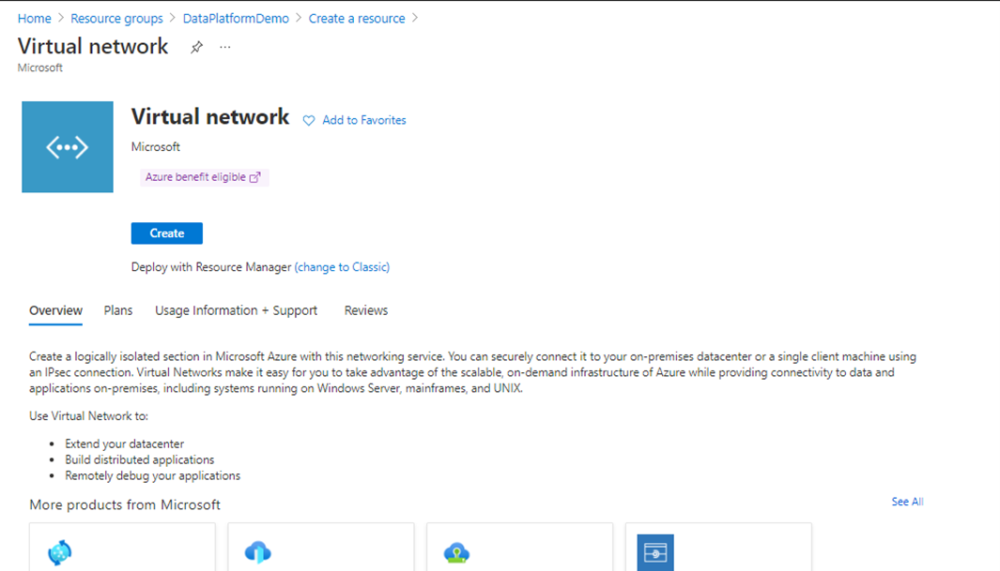
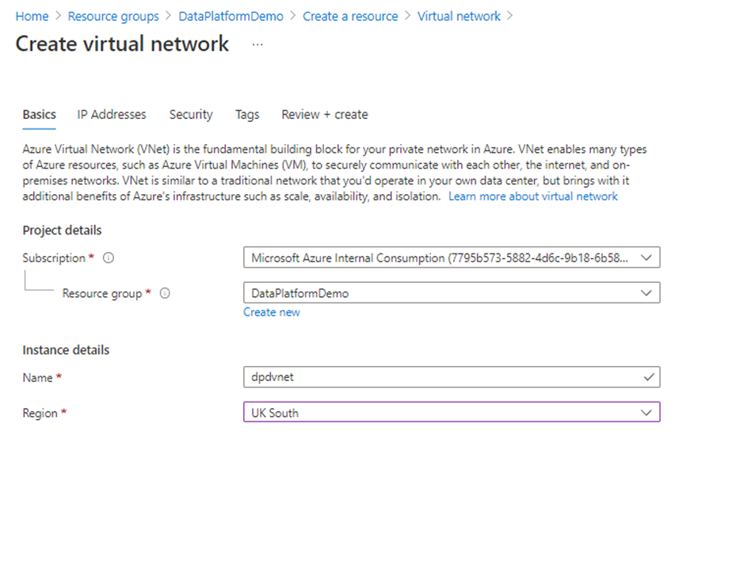
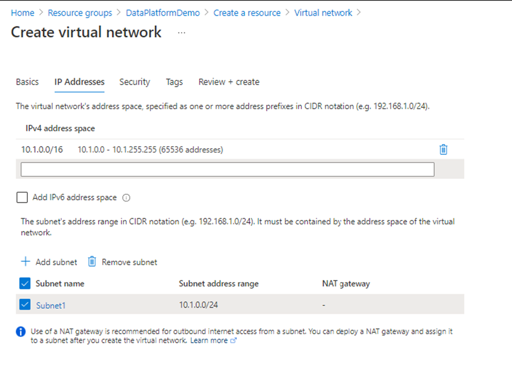
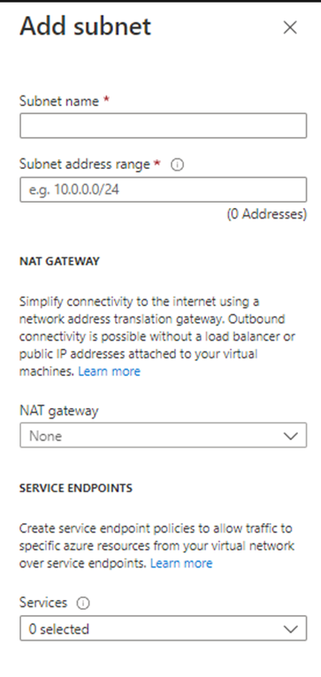
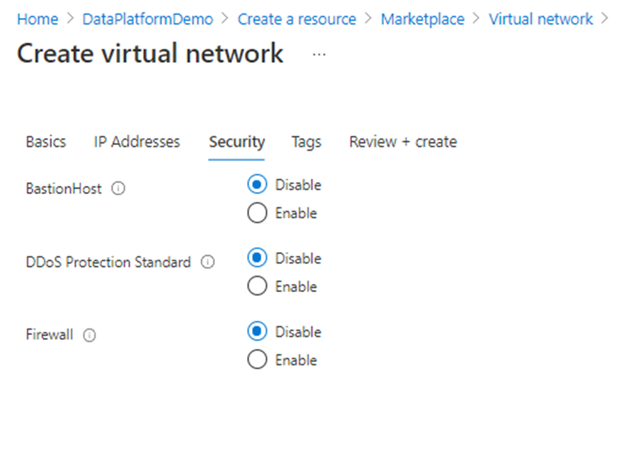

# Lab 1: Create Vnet / Subnet(s)

## Purpose
A Vnet / Subnet(s) is being provisioned is a representation of your network in the Cloud. It is a logical separation of the Azure cloud permitting, amongst things, a dedicated and secure private network.
Read more here: Azure Virtual Network FAQ | Microsoft Docs

The vNet / Subnet(s) may already be provisioned in your subscription. You can check for this in the Azure portal as follows:

1. Login into Azure
2. Expand the Home blade and select 'Virtual Networks' (see below)
3. Check the results to determine if a Vnet is applicable to your project/Resource Group(s)

    

Selecting a VNet will display the services within the Vnet and also the Subnets to be queried:

If the Vnet / Subnet exists, progress to 'Lab 2: Create Windows (Bastion) VM Host'.

## Create the Vnet

- Select the Resource Group you will be creating the Vnet in:
  
- Select '+ Create'
- Enter 'Virtual Network' and select this option from the results returned:

  

The blade below will be displayed:

  

Enter the Vnet details:

| Key | Value |
|-----|-------|
| Resource Group | _resource group name_ |
| Name | _Vnet name_ |
| Region | _Select the required Azure region_ |

- Select 'IP Addresses'. Accept the default entries unless specific IP address ranges are required:

  

- Select '+ Add subnet' and enter the subnet details:

| Key | Value |
|-----|-------|
|Subnet name | your subnet name |
|Subnet address range | your subnet range |
| NAT gateway | (optional) Select NAT gateway |

  

- Select 'Next : Security' and maintain the defaults:
  
  

- Select 'Next : Tags > ' enter values (optional)
- Select 'Next : Review + create > '
- After 'Validation passed' has displayed, select 'Create'.

The Vnet / Subnet will be created after a short period.

## Additional Reading
[Quickstart: Create a virtual network - Azure portal - Azure Virtual Network | Microsoft Docs](https://docs.microsoft.com/en-us/azure/virtual-network/quick-create-portal)