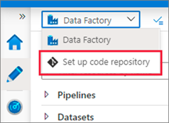

# Lab 10: ADF and Git Integration (CI/CD)

## Overview

By default, the Azure Data Factory user interface experience (UX) authors directly against the data factory service. This experience has the following limitations:

- The Data Factory service doesn't include a repository for storing the JSON entities for your changes. The only way to save changes is via the Publish All button and all changes are published directly to the data factory service.
- The Data Factory service isn't optimized for collaboration and version control.
- The Azure Resource Manager template required to deploy Data Factory itself is not included.

To provide a better authoring experience, Azure Data Factory allows you to configure a Git repository with either Azure Repos or GitHub. Git is a version control system that allows for easier change tracking and collaboration.

By using the git integration with Azure Data Factory, you enable familiar collaboration scenarios for data engineering teams; the ability to track and audit changes to your data factory, partial saves, and performance improvements. If you are deploying data pipelines across multiple environments with continuous delivery processes, git integration makes this easier by enabling automated validation checks, automated deployments, and parameterized deployments to simplify configuration changes across the different environments in your data platform.
Configuring and implementing a CI/CD process to manage deployments of your data factory is beyond the scope of this lab. To learn more, please refer to the below links

## Additional Reading 

[Source control - Azure Data Factory | Microsoft Docs](https://docs.microsoft.com/en-us/azure/data-factory/source-control)
[Continuous integration and delivery - Azure Data Factory | Microsoft Docs](https://docs.microsoft.com/en-us/azure/data-factory/continuous-integration-delivery)
[Automated publishing for continuous integration and delivery - Azure Data Factory | Microsoft Docs](https://docs.microsoft.com/en-us/azure/data-factory/continuous-integration-delivery-improvements)