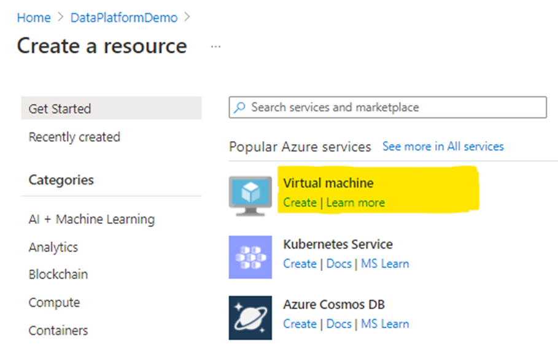
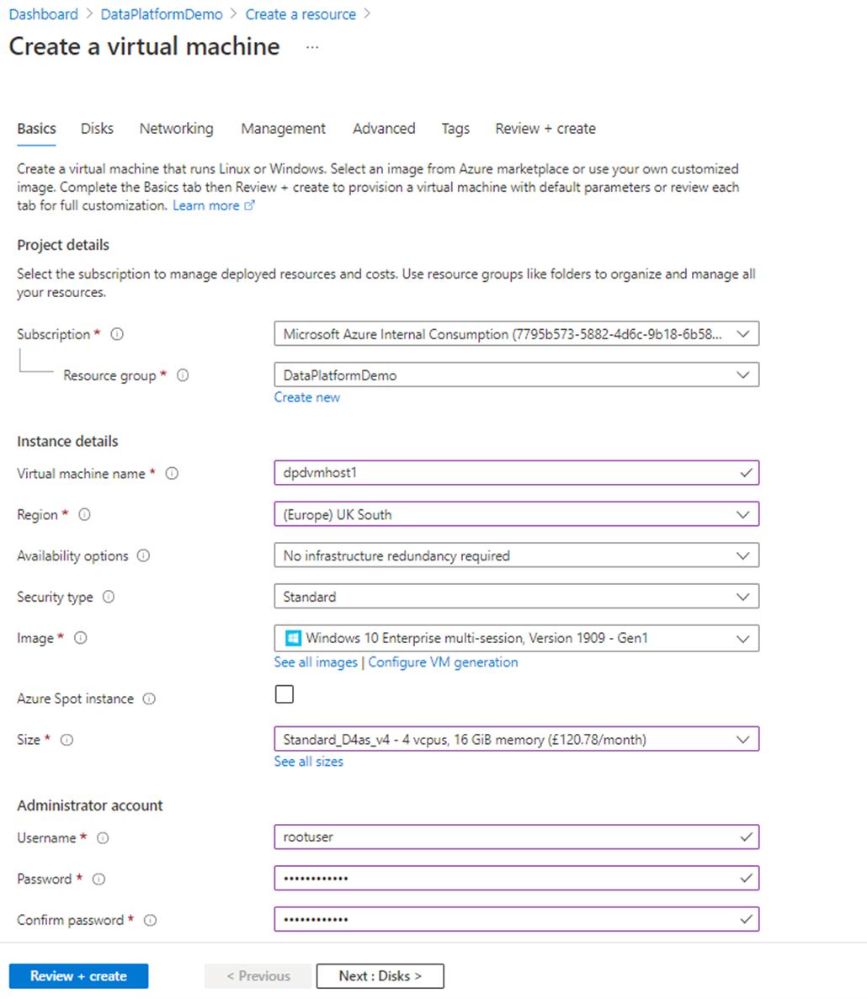
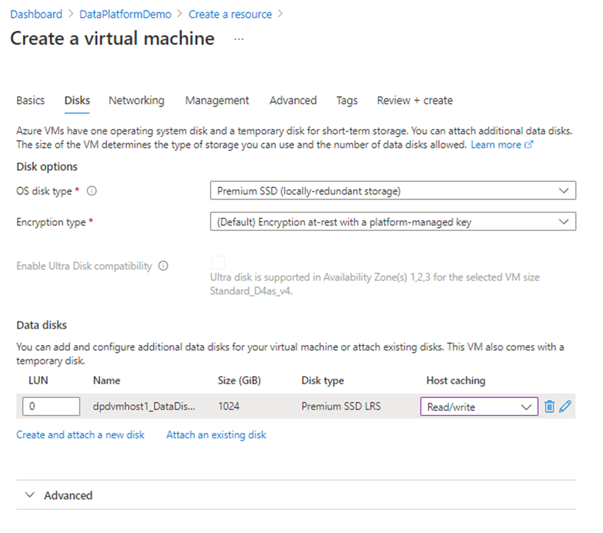
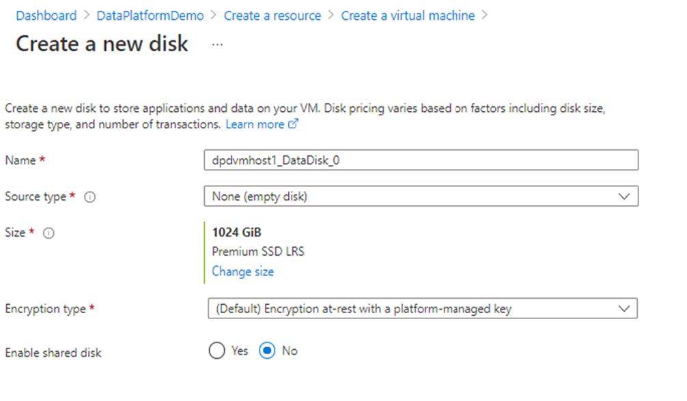
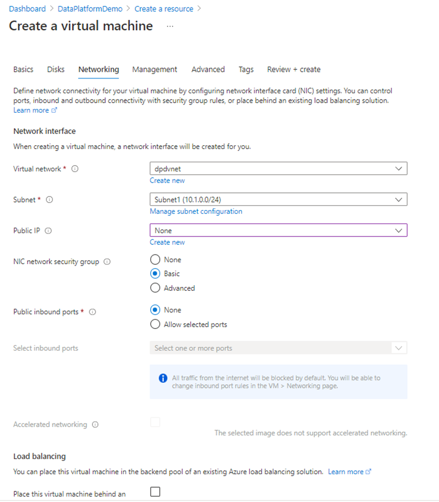
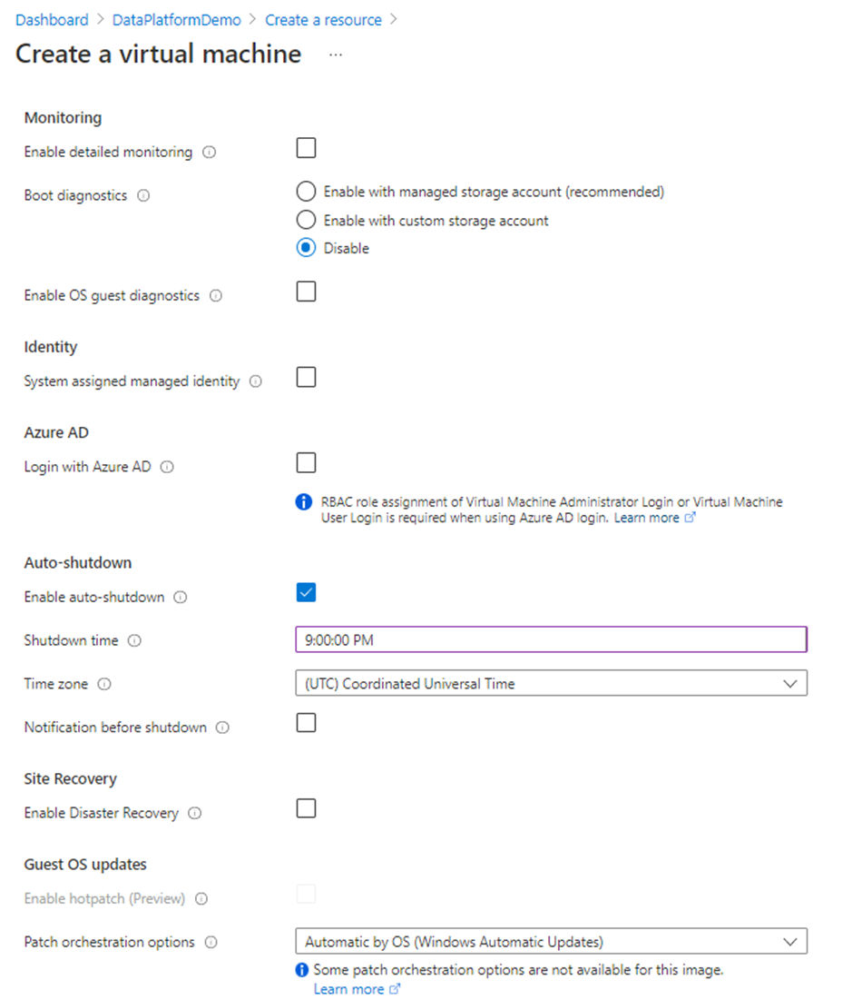
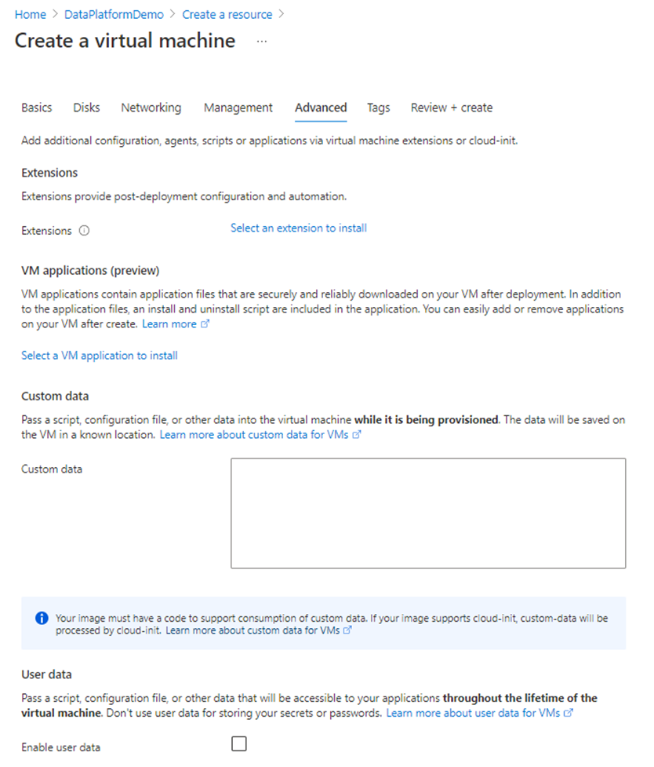
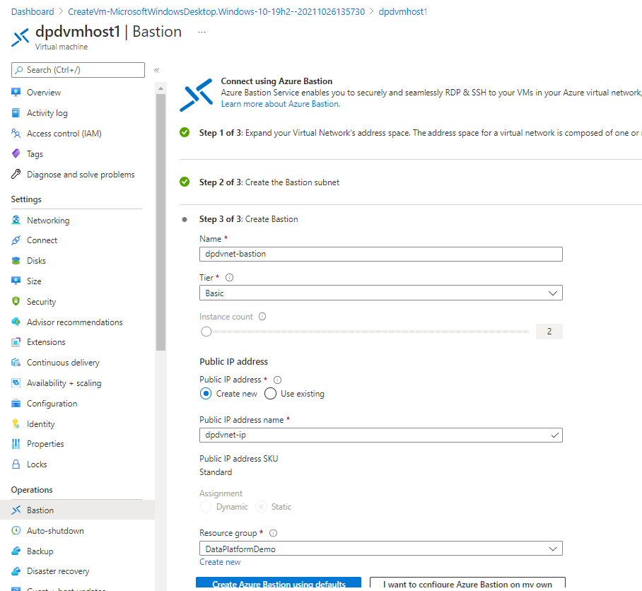

# Lab 2 - Windows (Bastion) VM Host

## Purpose

The Windows Virtual Machine host will serve three roles:

1. Permit secure access, into the Vnet, by using Bastion to remote onto the VM
    1. Read about Azure Bastion here: Azure Virtual Network FAQ | Microsoft Docs
1. Act as a host for applications and services that maybe useful. In this lab series those applications are:
    1. [SSMS (SQL-Server Management Studio)](https://docs.microsoft.com/en-us/sql/ssms/download-sql-server-management-studio-ssms?view=sql-server-ver15)
    2. [Azure Storage Explorer](https://azure.microsoft.com/en-gb/features/storage-explorer/)
1. Act as host for Azure Data Factory Self Hosted Integration Runtime

## Create the Windows VM Host

- Select the Resource Group in which you will be creating the Vnet
- Select '+ Create'. The Virtual Machine option appears on the 'Create a Resource' page (as below): 
 

- Select 'Create' on Virtual Machine

| Key | Value |
|-----|-------|
| Resource Group | your resource group |
| Virtual machine name | enter the VM name |
| Region | Select your Azure Region | 
| Availability options| No infrastructure redundancy required _Production consideration required_ |
| Security Type | Standard _Production consideration required_ |
| Image | Windows 10 Enterprise / Windows Server 2019 _Production consideration required_ |
| Azure Spot instance | Not selected |
| Size | Minimum 2x vcpu, 8GB RAM _Production consideration required_ |
| *Administrator account*: Username | _enter username_ |
| *Administrator account*: Password | _enter password_
| *Inbound port rules*: Public inbound ports| 'Allow selected ports' _Production consideration required_ |
| *Inbound port rules*: Select inbound ports | HTTPS (443) _Production consideration required_|
| Licensing | [Azure Hybrid Benefit](https://docs.microsoft.com/en-gb/azure/virtual-machines/windows/hybrid-use-benefit-licensing?WT.mc_id=Portal-Microsoft_Azure_Compute) (Select if applicable) |

- Select 'Next : Disks >'
| Key | Value |
|-----|-------|
| OS disk type | 'Premium SSD' _Production consideration required_ |
| Encryption Type | '(Default) Encryption at-rest' _Production consideration required_ |
| Enable Ultra Disk compatability |	Unchecked _Production consideration required_ |

- Select 'Create and attach a new disk':

| Key | Value |
|-----|-------|
|Name | _VM host disk name_ |
|Source Type | 'Non (empty disk' _Production consideration required_ |
|Size | _disk size/capacity SKU required_ _Production consideration required_ |
| Encryption Type | '(Default) Encryption at-rest' _Production consideration required_ |
|Enable shared disk	| No _Production consideration required_ |

- Select 'Next : Networking >'

| Key | Value |
|-----|-------|
| Virtual network | Name of VNet created |
| Subnet | Name of subnet created _Production consideration required_ |
| Public-IP | None _Production consideration required_ |
| NIC network security group | Basic _Production consideration required_ |
| Public inbound ports | None _Production consideration required_ |
| Accelerated Networking | Checked _Production consideration required_ |
| Load Balancing | Unchecked  _Production consideration required_ |

- Select 'Next : Management >'

For non-production machines the majority of these options are not required. Use the image (below) to complete this blade, otherwise, consider what options are required [and appropriate] for you environment.

- Select 'Next : Advanced >'
For non-production machines the majority of these options are not required. Use the image (below) to complete this blade, otherwise, consider what options are required [and appropriate] for you environment.

- Select 'Next : Tags > ' enter values (optional)
- Select 'Next : Review + create  >'
- After 'Validation passed' has displayed, select 'Create'.
 
## Azure Bastion Setup

Once virtual machine has been deployed, navigate to the resource and click 'Bastion' under Operations, and enable bastion access to the VM. The steps in the wizard will create a new Subnet in the Vnet, along with a public IP for use to connect to the VM from your workstation.

## Additional Resources
[Azure Region and Availability Zone details | Microsoft Docs](https://docs.microsoft.com/en-us/azure/availability-zones/az-overview)
[Azure Bastion subnet | Microsoft Docs](https://docs.microsoft.com/en-us/azure/bastion/configuration-settings#subnet)
