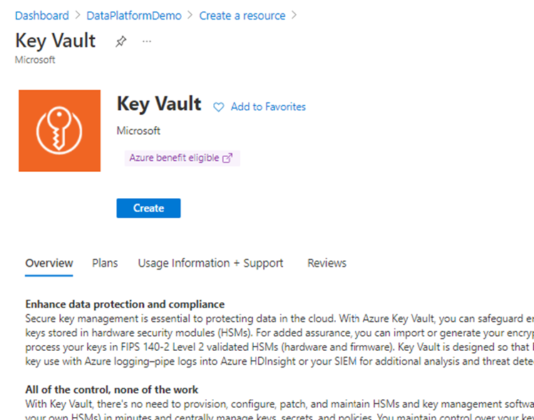
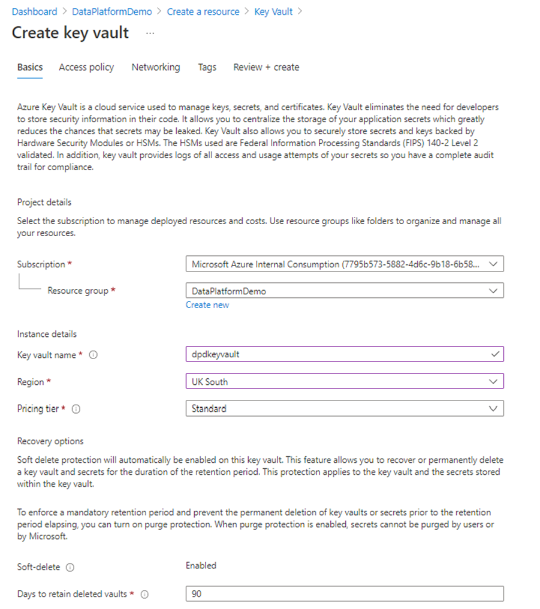
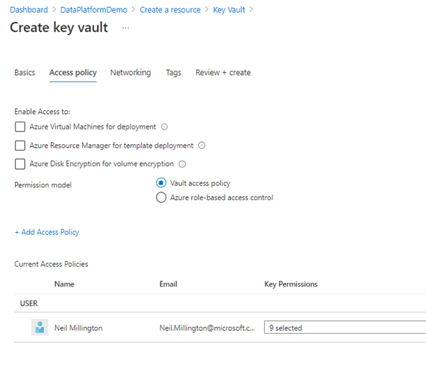
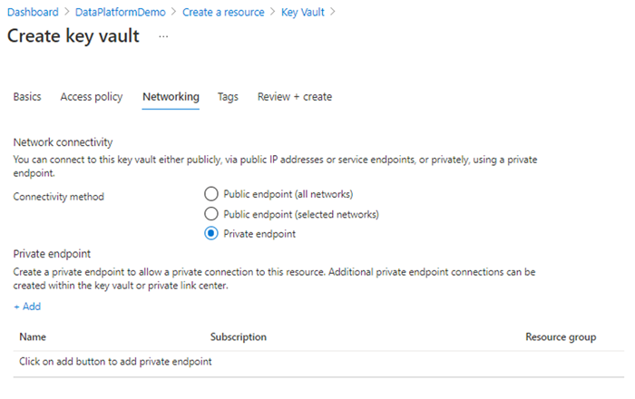
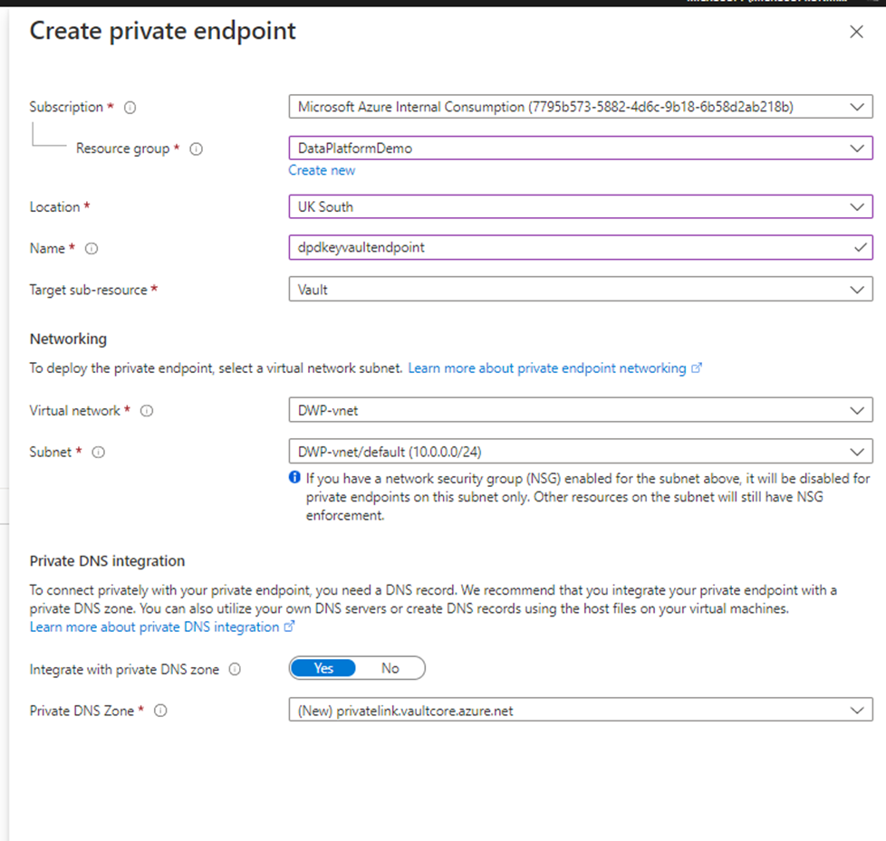
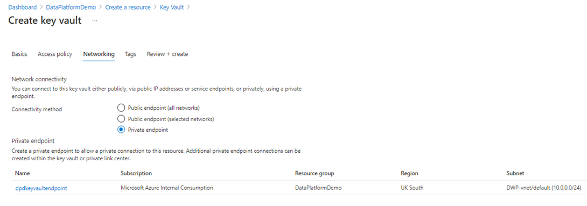

# Lab 3 - Key Vault (AKV)

## Purpose

Azure Key Vault (AK) is a cloud service for securely storing and accessing secrets. A secret is anything that you want to tightly control access to, such as API keys, passwords, certificates, or cryptographic keys. AKV service supports two types of containers: vaults and managed hardware security module (HSM) pools. Vaults support storing software and HSM-backed keys, secrets, and certificates. Managed HSM pools only support HSM-backed keys.
For this series of labs we will be creating a Key vault to store the password for an Azure SQLDB that utilises SQL Authentication.

## Create the Key Vault resource

- Select the Resource Group in which you will be creating the AKV
- Select '+ Create', the 'Create a Resource' blade appears
- Enter 'Key Vault' and select this option from the results returned
- The 'Key Vault' blade appears (as below):

- Select 'Create':

| Key | Value |
|-----|-------|
|Subscription | Select the required subscription |
|Resource group | Select the required resource group |
|Key vault name	| Enter the name of the AKV |
|Region	| Select the Azure region |
|Pricing Tier | 'Standard' |
|Days to retain deleted vaults | 90  _Production consideration required_ |
|Purge protection | 'Disable….' _Production consideration required_ |

- Select 'Next : Access policy > ':

The default selections can be kept on this page depending upon any differences you require between a production and a non-production AKV or the standards as enforced with your organisation.

Ensure, as a minimum, your Azure login appears under 'Current Access Policies'. If it does not, grant all options, via '+ Add Access Policy'.

| Key | Value |
|-----|-------|
|Permission model | 'Vault'  _Production consideration required_ | 

- Select 'Next : Networking > ':

| Key | Value |
|-----|-------|
|Connectivity method | 'Private endpoint' |

- Select '+ Add' under 'Private Endpoint' to create an endpoint for the AKV:

| Key | Value |
|-----|-------|
| Subscription | Select the required subscription |
| Resource group | Select the required resource group |
| Location| Select the Azure region|
| Name | Enter the name of the Key vault endpoint|
| Target sub-resource | 'Vault' _Production consideration required_ |
| *Networking*:	Virtual Network	|VNet name|
| *Networking*:	Subnet | Subnet name |
| *Private DNS Integration*: Integrate with private DNS zone | 'Yes' |
| *Private DNS Integration*: Private DNS Zone | Select New > Privatelink.vaultcore.azure.net |

- Select 'Ok' to accept the endpoint settings.

The 'Create key vault' blade will re-display populated with the recently created endpoint details :
 

- Select 'Next : Tags > ' enter values (optional)
- Select 'Next : Review + create >'
- After 'Validation passed' has displayed, select 'Create'. 

The Azure Key Vault will be created after a short period.

## Additional Reading

[Azure Key Vault documentation | Microsoft Docs](https://docs.microsoft.com/en-us/azure/key-vault/)

[Integrate Key Vault with Azure Private Link | Microsoft Docs](https://docs.microsoft.com/en-us/azure/key-vault/general/private-link-service?tabs=portal)

[Virtual network service endpoints for Azure Key Vault | Microsoft Docs](https://docs.microsoft.com/en-us/azure/key-vault/general/overview-vnet-service-endpoints)
