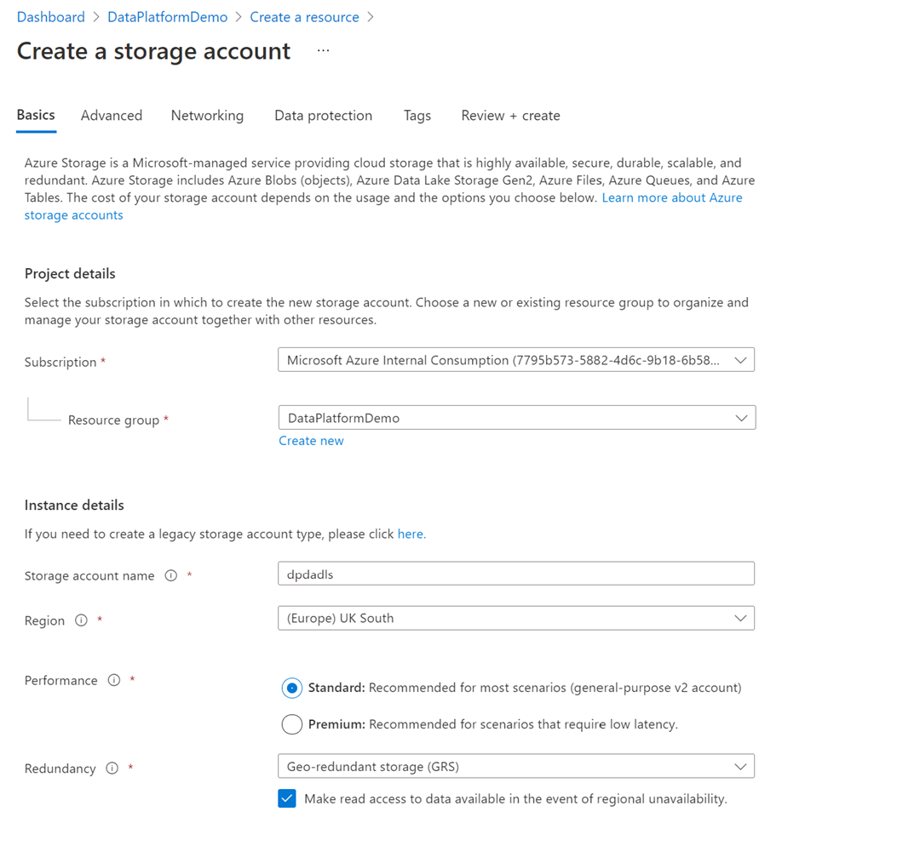

# Lab 4 - Azure Data Lake (ADLS)

## Purpose

Data Lake Storage Gen2 (ADLS) makes Azure Storage the foundation for building enterprise data lakes on Azure. Designed from the start to service multiple petabytes of information while sustaining hundreds of gigabits of throughput, Data Lake Storage Gen2 allows you to easily manage massive amounts of data.

## Create the ADLS resource

- Select the Resource Group in which you will be creating ADLS
- Select '+ Create'. The Storage Account option appears on the 'Create a Resource' page (as below):

- The 'Create', under Storage Account, the 'Create a storage account' blade appears (as below):

| Key | Value |
|-----|-------|
|Subscription | Select the required subscription |
|Resource group | Select the required resource group
|*Instance details*:Storage account name | Enter the name of the ADLS resource |
|*Instance details*: Region	|Enter the Azure region|
|*Instance details*: Performance| 'Standard:…' _Note: Premium cannot be selected with ADLS_ |
 |*Instance details*: Redundancy | 'Locally-redundant….' _Production consideration required_ |

- Select 'Next : Advanced > '

The default selections can be kept on this page depending upon any differences you require between a production and a non-production environment or the standards as enforced with your organisation.

**Important: ensure the following option is checked/enabled on the 'Advanced' section**:

| Key | Value |
|-----|-------|
| Data Lake Storage Gen2 | Enable hierarchical namespace Checked / Enabled |

- Select 'Next : Networking > '

| Key | Value |
|-----|-------|
| *Network connectivity*: Connectivity method | 'Private endpoint' |

- Select '+ Add private endpoint' under 'Private Endpoint' to create an endpoint for ADLS:

| Key | Value |
|-----|-------|
| Subscription | Select the required subscription |
| Resource group | Select the required resource group |
| Location | Select the Azure region |
| Name | Enter the name of the Key vault endpoint |
| Storage sub-resource | 'dfs' |
| *Networking*: Virtual Network | VNet name |
| *Networking*: Subnet | Subnet name | 
| *Private DNS Integration*: Integrate with private DNS zone | 'Yes' |
| *Private DNS Integration*: Private DNS Zone | Select New > Privatelink.blob.core.windows.net |
 

- Select 'Ok'
- Select 'Next : Data protection > '

The default selections can be kept on this page depending upon any differences you require between a production and a non-production environment or the standards as enforced with your organisation.

- Select 'Next : Tags > ' 
    - Enter values (optional)
- Select 'Next : Review + create >'
- After 'Validation passed' has displayed, select 'Create'

## Additional Reading

[Azure Data Lake Storage Gen2 Introduction | Microsoft Docs](https://docs.microsoft.com/en-us/azure/storage/blobs/data-lake-storage-introduction)

[Use private endpoints - Azure Storage | Microsoft Docs](https://docs.microsoft.com/en-us/azure/storage/common/storage-private-endpoints)

[Configure Azure Storage firewalls and virtual networks | Microsoft Docs](https://docs.microsoft.com/en-us/azure/storage/common/storage-network-security?tabs=azure-portal)