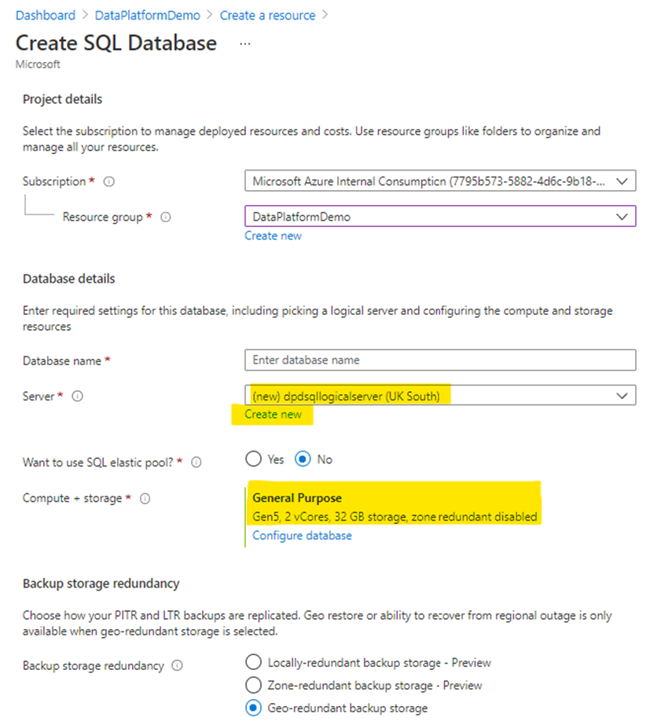
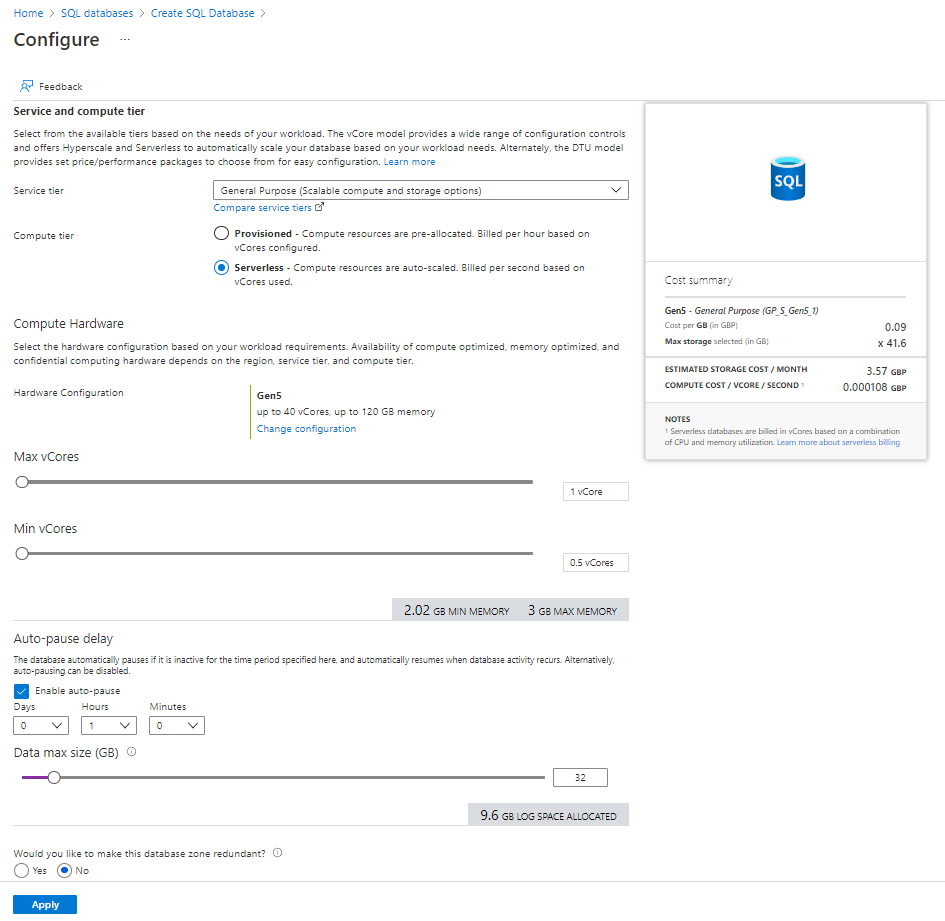
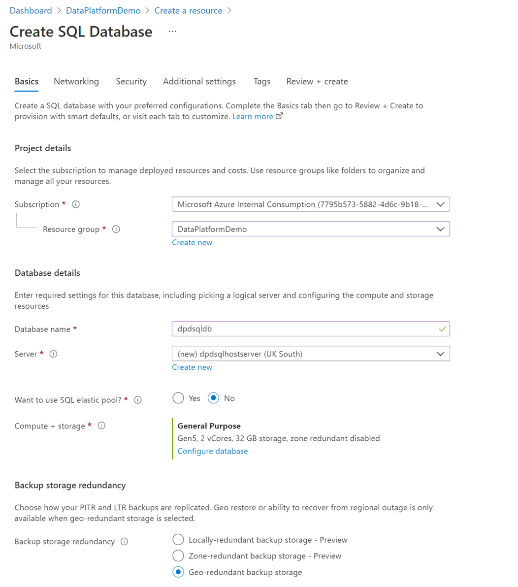

# Lab 5 -  Azure SQL DB (SQLDB)

## Purpose

With Azure SQL Database, you can create a highly available and high-performance data storage layer for the applications and solutions in Azure. Azure SQL Database (SQLDB) is a fully managed platform as a service (PaaS) database engine that handles most of the database management functions such as upgrading, patching, backups, and monitoring without user involvement.

## Create the Azure SQLDB resource

- Select the Resource Group in which you will be creating the SQLDB
- Select '+ Create'. The SQL Database option appears on the 'Create a Resource' page (as below): 

- Select 'Create' under 'SQL Database'

| Key | Value |
|-----|-------|
| Subscription | Select the required subscription |
| Resource group | Select the required resource group |
| *Database Details*: Database name | Enter the name of the SQLDB |
| *Database Details*: Server | Select the SQLDB logical server, OR Select 'Create new' (highlighted in yellow, see ['Create SQL Database Server' section](#Create-SQL-Database-Server) ) _Production consideration required_ |
| Want to use SQL elastic pool? | No  _Production consideration required_ |
| Compute + storage | Keep the default option OR Select 'Configure database' ([see 'Configure  SQL Database Server' section](#Create-SQL-Database-Server) ) |
| Backup Storage redundancy	| 'Locally-redundant….' _Production consideration required_ |

## Create SQL Database Server

Selecting 'Create new' on the 'Create SQL Database' blade will enable an SQLDB logical server to be created. Azure SQLDB must be attached to a logical server.

| Key | Value |
|-----|-------|
| *Server Details*: Server name | Select the required resource group |
| *Server Details*: Location | Select the Azure region |
| *Authentication*: Authentication method | Use SQL Authentication |
| *Authentication*: Server admin login | Enter the admin login |
| *Authentication*: Password | Confirm password	enter the admin password |

- Select 'Ok'

### Configure SQL Database Server

Selecting 'Configure database' on the 'Create SQL Database' blade will enable the compute to be selected and provisioned.

| Key | Value |
|-----|-------|
| Service and Compute tier | Select 'General Purpose…' |
| Compute tier | Select 'Serverless…' |
| *Compute Hardware* : Hardware Configuration | Select 'Change configuration' |
| vCores | Use the sliders to select the max and min required vCores _Production consideration required_ |
| Auto-pause Delay | Enable auto-pause, keep default of 1 hour (minimum) |
| Data max size (GB) | Use the slider to select the required number of data GBs _Production consideration required_ |
| Would you like…..zone redundant ? | Select 'No' |

- Select 'Ok'
The completed 'Create SQL Database' blade should now look similar to the image below:

- Select 'Next : Networking > '

| Key | Value |
|-----|-------|
| Network Connectivity | Select 'Private Endpoint' _Production consideration required_ |
| Private endpoints | Select '+ Add private endpoint' - See ['Create SQL Private Endpoint' section](#Create-SQL-Private-Endpoint) |
| Connection policy | Select 'Default – Uses…' _Production consideration required_ |
| *Encrypted connections*: Minumum TLS version | Select 'TLS 1.2' _Production consideration required_ |

### Create SQL Private Endpoint

| Key | Value |
|-----|-------|
| Subscription | Select the required subscription |
| Resource group | Select the required resource group |
| Location | Select the Azure region |
| Name | Enter the name of the SQL endpoint |
| Target sub-resource | 'SqlServer' |
| *Networking*:	Virtual Network	| VNet name|
| *Networking*:	Subnet | Subnet name |
| *Private DNS Integration*: Integrate with private DNS zone | 'Yes' |
| *Private DNS Integration*: Private DNS Zone | Select New > Privatelink.database.windows.net |

The 'Create SQL Database' blade should now look similar to the image below:

- Select 'Ok'
- Select 'Next : Security > '

| Key | Value |
|-----|-------|
| *Microsoft Defender for SQL*: Enable Microsoft Defender for SQL | Select 'Now now' |
| Identity (Preview) | Select 'System-assigned identity enabled |

- Select 'Next : Additional Settings > ' (no changes are required on this screen, accept the defaults)

- Select 'Next : Tags > ' enter values (optional)
- Select 'Next : Review + create > '
- Select 'Create'

## Add SQLDB Credentials to Key Vault (AKV)

Azure Key Vault  allows secrets (e.g. passwords, certificates) to be securely stored. We will use AKV to store the username and password.

As we created and enabled Private Link for the vault while deploying, we need to connect to the service from within the Vnet to add secrets. We will achieve this via the Windows VM we created in a previous lab.

- Select the Resource Group the Windows Vitual Machine (WVM) is located in.
- Ensure the WVM is in a Running state / 'Start' the WVM if it is in a stopped state
- Select 'Connect'
- Select 'Bastion' off the sub-menu

- Select 'Use Bastion'

- Enter the connection details (username / password) and connect to the host

You are now on the WVM (remote) desktop. 

Log onto Azure via this desktop, and select the Resource Group you are provisioning these resources into.

- Select the AKV resource
- Select 'Secrets'
- Select 'Generate/Import'

- Enter the details for the SQLDB 

| Key | Value |
|-----|-------| 
| Upload Options | Manual |
| Name | Name for the secret |
| Value | Enter the SQLDB Admin password |
| Content Type (optional) | Enter a description for the secret |

 
- Select 'Create'
- Do the same for the SQL Username; on completion your Key Vault Secrets should look like the below image:

